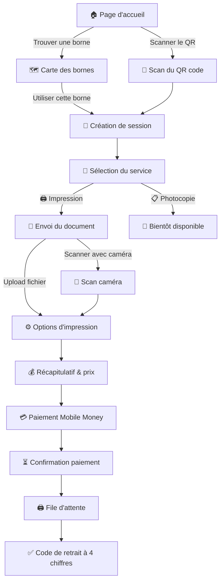
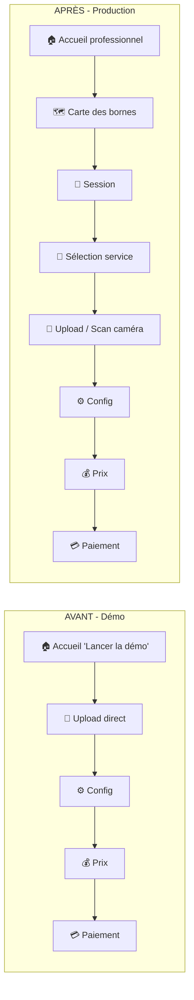

# Réforme : De la démo à l'application de production

## Contexte

L'application actuelle est un **prototype de démonstration** centré uniquement sur l'impression, avec un kiosk ID câblé en dur, des mentions "démo/prototype" partout, et un seed minimal (1 borne sans coordonnées GPS).

**Objectif** : transformer cette démo en une **vraie application de production** avec :
- Un **écran de sélection de service** (Impression active + Photocopie "Bientôt disponible")
- Un parcours utilisateur **propre et guidé** pour l'impression
- Un **seed enrichi** avec plusieurs bornes dans différents statuts
- **Zéro mention** de démo, prototype ou test

> [!NOTE]
> **L'app est une interface unifiée** — pour l'instant, pas de distinction visible entre "interface borne" et "app mobile". L'utilisateur ouvre l'app, choisit son service, suit les étapes, voit la carte. Tout est fluide et cohérent.

---

## 1. Comprendre les services

### 🖨️ Impression (actif — service principal)

L'utilisateur envoie un fichier depuis son téléphone et la borne l'imprime.

**Deux méthodes d'envoi** (déjà implémentées) :
- **Upload classique** : PDF, JPG/PNG, DOCX depuis la galerie ou les fichiers du téléphone
- **Scan caméra** : photographier un document papier avec la caméra du téléphone (les photos sont assemblées en PDF)

Le scan caméra n'est **pas** un service à part — c'est juste une méthode alternative d'envoi dans le flux Impression.

### 📋 Photocopie (désactivé — "Bientôt disponible")

L'utilisateur insère un document physique dans la borne, sélectionne ses options, et la borne le copie. Ce service nécessite du **matériel physique** (scanner intégré à la borne) qu'on n'a pas encore.

→ Affiché dans l'écran de sélection de service mais **grisé** avec un badge "Bientôt disponible".

---

## 2. Parcours utilisateur complet

### Diagramme global



### Étapes détaillées du flux Impression

| Étape | Page | Description |
|-------|------|-------------|
| 1 | `/flow/service` | **Sélection du service** — 2 cartes : Impression (active) + Photocopie (grisée) |
| 2 | `/flow/upload` | **Envoi du document** — Upload fichier OU scanner avec caméra |
| 3 | `/flow/config` | **Options d'impression** — Copies, N&B/Couleur, Recto-verso, Format |
| 4 | `/flow/price` | **Récapitulatif** — Détail ticket de caisse + prix total |
| 5 | `/flow/payment` | **Paiement** — Choix opérateur Mobile Money + numéro de téléphone |
| 6 | `/flow/pending` | **Attente confirmation** — Polling du statut paiement |
| 7 | `/flow/queue` | **File d'attente** — Position dans la file + statut impression |
| 8 | `/flow/ready` | **Retrait** — Code à 4 chiffres affiché à l'écran |

### Options d'impression

| Option | Choix possibles | Défaut |
|--------|----------------|--------|
| Nombre de copies | 1 – 20 | 1 |
| Mode couleur | ⬛ Noir & Blanc / 🎨 Couleur | N&B |
| Recto-verso | Oui / Non | Non |
| Format papier | A4 / A3 | A4 |

### Tarifs (FCFA par feuille physique)

| Mode | Recto | Recto-verso |
|------|-------|-------------|
| Noir & Blanc | 50 | 80 |
| Couleur | 150 | 250 |

---

## 3. Ce qui change concrètement

### 3.1. Page d'accueil (`page.tsx`) — Refonte complète

**Avant (démo)** :
- ❌ Bouton "Lancer la démo" avec un UUID de borne en dur
- ❌ Texte "Prototype — Démonstration uniquement"
- ❌ Affichage du kiosk ID de démo

**Après (production)** :
- ✅ Tagline : **"Impression • Photocopie • Scan"**
- ✅ Bouton principal : **"Trouver une borne près de moi"** → `/carte`
- ✅ Bouton secondaire : **"J'ai déjà un QR code"** → explications scan
- ✅ Design premium, professionnel, aucune mention de test/démo
- ✅ Footer discret avec version et copyright

---

### 3.2. Nouvel écran de sélection de service (`/flow/service`) — 🆕

C'est le **cœur de la réforme**. Cet écran apparaît juste après la création de session (après le scan QR).

**Design** : 2 grandes cartes visuelles

| Carte | État | Icône | Description | Action au clic |
|-------|------|-------|-------------|----------------|
| 🖨️ **Impression** | ✅ Actif | Imprimante | "Envoyez un document depuis votre téléphone et récupérez-le imprimé" | → `/flow/upload` |
| 📋 **Photocopie** | 🔒 Grisé | Photocopieuse | "Copiez un document papier directement à la borne" | → Toast "Bientôt disponible" |

La carte Photocopie aura :
- Un overlay semi-transparent
- Un badge **"Bientôt disponible"**
- Un clic qui montre un message (pas de navigation)

---

### 3.3. Adaptation du flux de session (`/s`)

**Avant** : après création de session → redirige directement vers `/flow/upload`  
**Après** : après création de session → redirige vers **`/flow/service`** (sélection du service)

---

### 3.4. Session context enrichi

Ajout de `serviceType` pour conditionner le parcours :

```typescript
// Ajout dans session-context.tsx
serviceType: "impression" | "photocopie" | null;
setServiceType: (type: "impression" | "photocopie") => void;
```

---

### 3.5. Page config — Adaptation mineure

La page config reste quasiment identique pour l'impression. Les changements viendront plus tard quand la photocopie sera active (options différentes).

Pour l'instant, le titre de la page affichera **"Options d'impression"** (c'est déjà le cas).

---

## 4. Seed enrichi (`seed.py`)

### 4.1. Bornes

| # | Nom | Quartier | Statut | Lat | Lng |
|---|-----|----------|--------|-----|-----|
| 1 | Borne Cocody Riviera | Cocody, Abidjan | ✅ `actif` | 5.3484 | -3.9785 |
| 2 | Borne Plateau Centre | Plateau, Abidjan | ✅ `actif` | 5.3220 | -4.0166 |
| 3 | Borne Yopougon Marché | Yopougon, Abidjan | 🔧 `maintenance` | 5.3395 | -4.0820 |
| 4 | Borne Treichville Gare | Treichville, Abidjan | ⛔ `hors_ligne` | 5.3050 | -3.9960 |
| 5 | Borne Abobo Marché | Abobo, Abidjan | ✅ `actif` | 5.4185 | -4.0200 |

### 4.2. Agents

| Agent | Affecté à | PIN |
|-------|-----------|-----|
| Agent Hamed | Borne Cocody Riviera | 1234 |
| Agent Fatou | Borne Plateau Centre | 5678 |
| Agent Moussa | Borne Yopougon Marché | 9012 |
| Agent Aminata | Borne Abobo Marché | 3456 |

### 4.3. Comportement sur la carte

- **Bornes actives** (vert) → Popup avec bouton **"Utiliser cette borne"** → crée une session
- **Borne en maintenance** (orange) → Popup avec message **"Cette borne est en maintenance"** — pas de bouton d'action
- **Borne hors ligne** (rouge) → Popup avec message **"Borne indisponible"** — pas de bouton d'action

### 4.4. Stratégie de seed

Le seed doit être **idempotent** :
- Si une borne existe déjà (même UUID) → met à jour ses coordonnées et son statut
- Si elle n'existe pas → la crée
- Pareil pour les agents

---

## 5. Récapitulatif des fichiers à modifier/créer

### Frontend

| Fichier | Action | Changement |
|---------|--------|------------|
| [page.tsx](file:///c:/Users/DPcomputer/Desktop/P_DOC/HTML_CSS_JS/borne-multiservice/frontend/app/page.tsx) | ✏️ MODIFY | Supprimer mentions démo, refonte design production |
| `app/flow/service/page.tsx` | 🆕 NEW | Écran de sélection du service (2 cartes) |
| [s/page.tsx](file:///c:/Users/DPcomputer/Desktop/P_DOC/HTML_CSS_JS/borne-multiservice/frontend/app/s/page.tsx) | ✏️ MODIFY | Rediriger vers `/flow/service` au lieu de `/flow/upload` |
| [session-context.tsx](file:///c:/Users/DPcomputer/Desktop/P_DOC/HTML_CSS_JS/borne-multiservice/frontend/lib/session-context.tsx) | ✏️ MODIFY | Ajouter `serviceType` au context |
| [price/page.tsx](file:///c:/Users/DPcomputer/Desktop/P_DOC/HTML_CSS_JS/borne-multiservice/frontend/app/flow/price/page.tsx) | ✏️ MODIFY | Afficher "Impression" dans le libellé du récapitulatif |
| [StepHeader.tsx](file:///c:/Users/DPcomputer/Desktop/P_DOC/HTML_CSS_JS/borne-multiservice/frontend/components/StepHeader.tsx) | ✏️ MODIFY | Adapter numéro d'étape (step 1 = service, step 2 = upload, etc.) |

### Backend

| Fichier | Action | Changement |
|---------|--------|------------|
| [seed.py](file:///c:/Users/DPcomputer/Desktop/P_DOC/HTML_CSS_JS/borne-multiservice/backend/app/seed.py) | ✏️ MODIFY | Ajouter 4 bornes + 3 agents supplémentaires, rendre idempotent |

> [!NOTE]
> **Pas de migration backend pour l'instant.** On n'ajoute pas `service_type` au modèle tant que la photocopie n'est pas active. Le seul service fonctionnel est l'impression, qui est déjà entièrement câblé. On évite la complexité inutile.

---

## 6. Résumé visuel des changements



---

## Verification Plan

### Automated Tests
- `python -m app.seed` — vérifier que le seed crée 5 bornes et 4 agents sans erreur
- `npm run build` — vérifier que le frontend compile sans erreur

### Manual Verification
1. **Page d'accueil** : aucune mention "démo", "prototype", ou "test"
2. **Carte** (`/carte`) : 5 bornes affichées avec les bons marqueurs (vert/orange/rouge)
3. **Clic sur une borne active** → popup avec bouton "Utiliser cette borne" → création de session → **écran de sélection de service**
4. **Écran de sélection** : carte Impression cliquable, carte Photocopie grisée avec badge "Bientôt disponible"
5. **Flux Impression complet** : upload → config → prix → paiement → file → code de retrait
6. **Borne en maintenance/hors ligne** : pas de bouton d'action dans le popup de la carte
